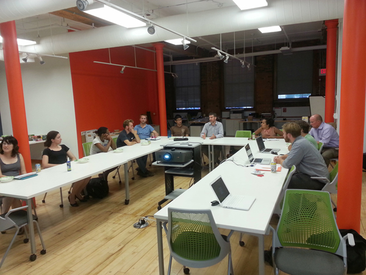

<h2><a href="{{ page.url }}">{{ page.title }}</a></h2>

{{ page.date | date_to_long_string }}

Code Island held its second post-summer [meetup](http://www.meetup.com/Rhode-Island-Code-for-America-Brigade/) on September 2nd. As usual, we met at [Tri Lab](https://www.google.com/maps/place/10+Davol+Square,+Providence,+RI+02903/@41.824152,-71.4398007,13z/data=!4m2!3m1!1s0x89e4456a8646dbf1:0x2259e0f433c149cf?hl=en), starting at 6pm. Sadly, your Storyteller arrived late, and the meet-up was already in full swing. I missed the review by co-captain Ryan Kelly of various projects from other brigades around the country as well as the review of the budget visualization project. 

Just as I sat down, Shawn Selleck started his review of the [candidates questionnaire on open data](/candidate-questionnaire/). This project has two parts. First, we want to define the questions and reach out to candidates. Second, we want to develop a simple, long-text survey results platform that anybody can use to send and receive survey results from political candidates. In order to get our survey to candidates in time for the November general election, we'll have to use an existing technology like Google Forms and finish the platform after the elections.

That topic sparked a lot of discussion about how specific we could hope to get with questions. It took us all the way to 8pm, when we broke up to let folks get home. Ryan, Thom and I stuck around and took care of house keeping.
